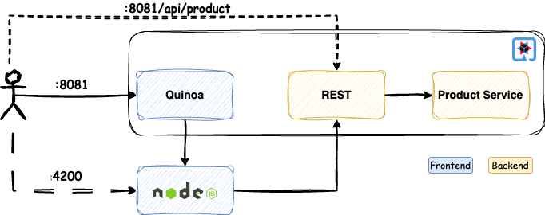

# Comparing Java Server Faces and Angular SPAs on Quarkus

## Are you a Full Stack Developer?
Do you need to write a Single Page Application (SPA) and are searching for the right tech stack? Are you from a Java or JavaScript background? Lots of questions, I know! But the most important one is: how should you start?

As an experienced Java developer who has also dabbled in TypeScript, I’ve realized that building web applications is not always straightforward. Often, either the backend or frontend uses your preferred stack, and any changes in one can require significant adaptations in the other. The cycle of recompiling, rebuilding, and testing both ends can be repetitive and time-consuming.

This is where [Quarkus](https://quarkus.io/) shines. Quarkus is more than just a tool for building web applications or microservices. It’s designed to simplify development, offering features like live coding, which lets you see changes immediately without restarting the application. This enhances productivity and reduces frustration.

In this article, I’ll demonstrate how you can build the same SPA using [Jakarta Server Faces](https://github.com/eclipse-ee4j/mojarra) (JSF) and [Angular](https://angular.dev/), both running on Quarkus. By comparing these two approaches, I hope to help you decide which stack best fits your requirements.

## Why Quarkus?
Quarkus is a versatile framework that allows you to build a wide variety of applications, thanks to its robust extension mechanism. This mechanism distinguishes between Quarkus extensions and external libraries, enhancing the framework's functionality and performance.

### Quarkus Extensions vs. External Libraries
Quarkus extensions are specifically developed and maintained by the Quarkus team, ensuring high quality and seamless integration into the Quarkus architecture. These extensions are open sourced and are designed to be processed at build time, enabling them to run efficiently in native mode using GraalVM. In contrast, external libraries, while usable within Quarkus applications, may not benefit from the same level of optimization or integration.

### Efficiency and Performance
Quarkus’s mission is to transform your entire application—including the libraries it depends on—into an artifact that consumes significantly fewer resources compared to traditional frameworks. This focus on efficiency is why Quarkus applications are both fast and lightweight.

### Implicit and Explicit Extensions
Certain extensions are added to your application implicitly based on the technologies you use. For instance, when developing a Jakarta Faces application, the [Undertow](https://undertow.io/) servlet container is included automatically as a runtime dependency. Additionally, for full-stack development using non-Java-based front-end technologies such as Angular, React, or Vue.js, Quarkus provides the [Quinoa](https://docs.quarkiverse.io/quarkus-quinoa/dev/index.html) extension. This extension facilitates the integration of modern front-end frameworks into your Quarkus-based application, allowing you to build robust full-stack solutions effortlessly.

## What Are Jakarta Server Faces and Angular?
**Jakarta Server Faces (JSF)** is a server-side framework for building Java web applications using Server-Side Rendering (SSR). It processes UI components and application logic on the server, generating complete HTML responses for each client request. This approach ensures tight backend integration and simplifies handling complex enterprise workflows. However, frequent server communication can result in slower interactions.

**Angular**, on the other hand, is a client-side JavaScript framework for building dynamic SPAs. It employs a component-based architecture, handles UI updates directly in the browser, and interacts with backend APIs for data. Angular also supports SSR through Angular Universal, enabling better SEO and faster initial load times, with subsequent updates handled on the client side.

In essence, JSF is ideal for enterprise systems with server-driven workflows, while Angular excels in creating responsive, modern UIs with high interactivity and scalability. Both can leverage SSR depending on the use case, but their core differences lie in where rendering and logic occur.

## The Application: Raspberry Pi Catalog
To compare these technologies, I built a simple application that displays a catalog of Raspberry Pi models. Users can filter, sort, and view the models. For simplicity, the app doesn’t include authentication or model editing.

The backend is implemented with Quarkus, and the frontend is developed using JSF (with [PrimeFaces](https://www.primefaces.org/)) and Angular (with [PrimeNG](https://primeng.org/)). Both PrimeFaces and PrimeNG are rich component libraries developed by the same company, making them ideal for this comparison.

## How the Application Looks
The SPA allows users to filter and sort Raspberry Pi models by various criteria. Here’s how the UI looks:

## Implementing the JSF Application
A JSF-based application requires a servlet container, and Quarkus supports this through the Undertow servlet container. The backend service, which uses [Panache ORM](https://quarkus.io/guides/hibernate-orm-panache) to access the database, is injected into the JSF managed bean. The frontend leverages the PrimeFaces [DataTable](https://www.primefaces.org/showcase/ui/data/datatable/basic.xhtml) component for listing products, enabling users to filter and sort them effortlessly.

Key advantages of using Quarkus include the ability to run the application as a standalone JAR file—no need for a traditional WAR file deployment. Moreover, during development, Quarkus’s live coding feature ensures that changes are reflected immediately without restarting the application.

When the user accesses the application URL on port 8080, the catalog page is displayed.

## Implementing the Angular Application
Angular applications typically run on a [Node.js](https://nodejs.org/) server. Quarkus’s Quinoa extension simplifies this by automatically starting a Node.js server when you run Quarkus in dev mode, serving the Angular app seamlessly.

This setup is more complex than the JSF approach but provides a modern, responsive UI. Since the Angular app operates on the client side, backend services must be exposed as REST APIs. Quarkus simplifies this by generating an [OpenAPI](https://www.openapis.org/) schema for the backend, which can be used to create Angular services. For this project, I used [Oval](https://orval.dev/) to generate Angular services, but other tools are also available.

The generated Angular client is injected into the Angular component, enabling seamless interaction with the backend. The frontend utilizes the PrimeNG [Table](https://primeng.org/table) component for listing, filtering, and sorting products.

As with the JSF app, Quarkus’s live coding ensures instant reflection of changes during development, eliminating the need to restart either the Node.js server or the application.

When the user accesses the application URL on port 8081, the request is routed through Quinoa, which proxies it and forwards the call to the Node.js server. Since the backend is running on Quarkus, the Angular application communicates with the REST API. Alternatively, users can directly access the Angular application on port 4200.

When a REST API is called, it is served by Quarkus’s REST extension, regardless of whether it is accessed directly by the user or by the Angular application.

## Choosing Between JSF and Angular
Both JSF and Angular have their strengths:
* **JSF**: Best for simple, fast-to-implement applications, particularly in enterprise settings.
* **Angular**: Ideal for modern, highly interactive, and scalable applications.
 
While JSF offers strong backend integration and simplicity, Angular provides a responsive and dynamic user experience. The choice depends on your project’s specific requirements.

## Conclusion
Quarkus is an excellent tool for building modern web applications, providing robust support for both JSF and Angular. Its features, such as live coding and seamless integration, make development efficient and enjoyable.

I’ve shared the source code for both implementations in my GitHub repository. Feel free to explore, and let me know if you have any questions or feedback. Lastly, kudos to the Quarkus team for creating such a fantastic framework!

Happy coding!

